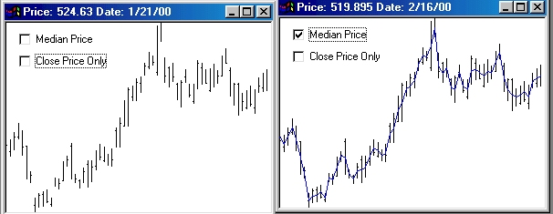



## Bar Chart ActiveX \(Freeware\)

### Description

BarChart.ocx is a bar chart control for stock market/commodity markets, etc. Full source code.

You can chart the open, high, low and close, the median and/or any other value you can think of.
 
### More Info
 

             |
---                |---
**Submitted On**   |2000-03-20 09:46:34
**By**             |[Richard Gardner](https://github.com/Planet-Source-Code/PSCIndex/blob/master/ByAuthor/richard-gardner.md)
**Level**          |Beginner
**User Rating**    |5.0 (15 globes from 3 users)
**Compatibility**  |VB 4\.0 \(32\-bit\), VB 5\.0, VB 6\.0, VB Script
**Category**       |[Custom Controls/ Forms/  Menus](https://github.com/Planet-Source-Code/PSCIndex/blob/master/ByCategory/custom-controls-forms-menus__1-4.md)
**World**          |[Visual Basic](https://github.com/Planet-Source-Code/PSCIndex/blob/master/ByWorld/visual-basic.md)
**Archive File**   |[CODE\_UPLOAD40933202000\.zip](https://github.com/Planet-Source-Code/richard-gardner-bar-chart-activex-freeware__1-6534/archive/master.zip)

